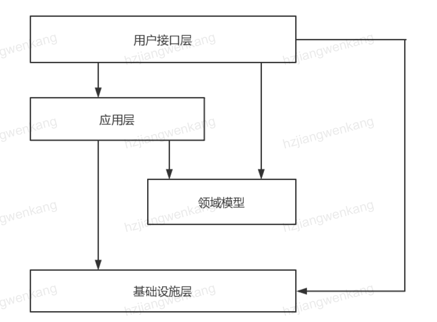

# ddd-skeleton

## 简介 

DDD项目工程骨架

## 背景

DDD的入门门槛很高，其中一个很重要的原因在于没有一个可参考的样例工程。只有一个具有足够复杂度的项目，
才能体现出DDD的优势和价值。但是，一个足够复杂的项目又会吓跑大部分的初学者，因为需要沉下心来了解项目
的领域知识。

如果说DDD在代码层面可以沉淀出一些东西，我觉得只有模块分层和一些通用的辅助类可以沉淀下来，其余的都是
业务逻辑相关的。所以我想分享我在实践DDD工程相关的模块分层和常用的辅助类，希望对DDD入门和希望快速搭建
DDD项目骨架的同学一个参考。

## 模块

1. 用户接口层对应web层。
2. 应用层对应application层。
3. 领域模型对应domain层。
4. 基础设施层对应infrastructure层。

注意：在一些DDD的实践和分享中，领域模型层是可以依赖基础设施层的，理论上将这是没有问题的，将基础设施的抽象
完全下层到infrastructure中。但实际开发过程中，要处理好这种依赖关系必须要小心翼翼。所以，我在模块划分中

## 使用

## MIT LICENSE